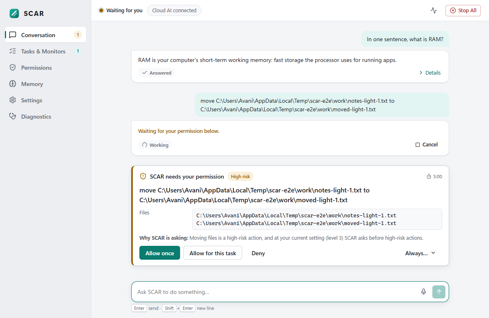

# SCAR — Systemic Cognitive Autonomous Responder

SCAR is an AI operator for your Windows 11 computer. Tell it what you want, typed or spoken, and it does it.

It opens apps and projects, runs commands and tests, reads the screen, drives a browser, researches the web, and
manages files. It also handles reminders and monitors, and sends email and messages once configured. It checks
that each action actually worked and asks before anything risky.

```
> open VS Code in my BISense folder
Opened BISense in Visual Studio Code.
> run the tests in C:\Projects\api
2 test(s) failed, 41 passed. Failing: tests/test_auth.py::test_refresh, tests/test_auth.py::test_expiry.
> find the failing test and fix it
  Running tests.
  Writing auth.py.
  Running tests.
Fixed the expiry check in auth.py; all 43 tests pass.
```

It runs at **zero recurring cost**: free cloud providers first, your local models (Ollama or llama.cpp) as a
fallback, and a deterministic fast path when no model is reachable.

## Quick start

Requirements: Windows 11, Python 3.11, [uv](https://docs.astral.sh/uv/). Optional: an NVIDIA GPU, a microphone,
Chrome or Edge.

```
git clone <this repo> scar && cd scar
uv sync
uv run playwright install chromium        # only if neither Chrome nor Edge is installed
uv run scar doctor                        # checks everything and tells you what to fix
```

Give SCAR a model (any one of these):

* **Free cloud (recommended)**: get a key at console.groq.com and run `uv run scar config set-secret GROQ_API_KEY`.
  Gemini (`GEMINI_API_KEY`), OpenRouter, Cerebras and others also work; see [docs/providers.md](docs/providers.md).
* **Local**: have Ollama running (`ollama pull qwen3:8b`), or install llama.cpp (`winget install ggml.llamacpp`)
  and point SCAR at a GGUF, and it runs `llama-server` itself:
  `uv run scar config set local_llm_model_path C:\models\qwen3-8b-q4_k_m.gguf`

The complete checklist is in [docs/SETUP.md](docs/SETUP.md). It covers required and optional steps, voice, email,
messaging, calendars and GitHub, what each needs, where to get it, and how to check it works.

Then:

```
uv run scar                               # interactive prompt
uv run scar "what's using my RAM"         # one-shot
uv run scar --voice                       # voice (push-to-talk Ctrl+Alt+Space; typing still works)
uv run scar daemon start                  # keep reminders and monitors running in the background
```

Emergency stop: **Ctrl+Alt+Shift+K** halts input, cancels tasks, kills child processes and stops speech.

## Desktop app

SCAR also has a desktop app: a Quick Bar (**Ctrl+Alt+Space**), a main window with the conversation and live task
activity, approval cards, status, voice, tasks and monitors, permissions, memory, settings, onboarding and
diagnostics. It is a client of the same runtime as the CLI, and both can run at once. See [docs/UI.md](docs/UI.md).



**Install from the installer:** run `SCAR_1.0.0_x64-setup.exe`. The build is unsigned, so Windows SmartScreen may say
"Windows protected your PC": choose *More info* → *Run anyway*. On first start the app sets up its private Python
environment (needs internet once).

**Build the installer** (needs Node.js + pnpm, Rust with the MSVC toolchain, and WebView2):

```
cd app && pnpm install && cd ..
uv run python scripts/build_installer.py   # → app/src-tauri/target/release/bundle/nsis/SCAR_1.0.0_x64-setup.exe
```

**Run from source** (development): see [docs/development.md](docs/development.md#desktop-app).

## Examples

* "Open VS Code in C:\Projects\site, start the dev server, and tell me when it's ready"
* "Look at my screen — what does this error mean?"
* "Research the Python walrus operator and save a summary with sources to walrus.md"
* "Watch process 4412 and tell me if it crashes"
* "Remind me every weekday at 9am to check the build"
* "Find the file in Documents that mentions the Q3 budget"
* "Remember that my BISense folder is at C:\Projects\BISense"
* "Email this report to Sarah" (after email is configured; always asks first)

## How it stays safe

The runtime, not the model, makes every permission decision:

* **Per-action risk**: LOW, MEDIUM, HIGH or CRITICAL.
* **Autonomy levels** (default 3): LOW and MEDIUM run automatically, HIGH asks first, and CRITICAL (payments,
  permanent deletion, protected paths) needs a typed confirmation code.
* **Guards**: a path guard that sees through junctions, short names and streams, and a command guard that uses
  PowerShell's own parser.
* **Injection defence**: taint tracking of anything that came from web pages, emails, files or the screen, and
  anchoring every action to what you actually asked for.
* **Secrets**: redaction everywhere, secrets kept in Windows Credential Manager, and an append-only audit log.

Details: [docs/security.md](docs/security.md).

## Commands

| Command | |
|---|---|
| `scar` / `scar "<objective>"` / `scar --voice` | REPL, one-shot, voice |
| `scar doctor [--deep]` | environment, providers, devices, security checks |
| `scar status` | tasks, monitors, loaded models, resources, provider health, data sent this session, permissions |
| `scar config show\|set\|validate\|path\|set-secret` | configuration ([docs/configuration.md](docs/configuration.md)) |
| `scar logs [-f] [--task ID] [--level]` | logs and per-task traces |
| `scar tasks list\|show\|cancel` | task history |
| `scar permissions list\|revoke\|policy` | grants and policy |
| `scar memory list\|search\|forget\|wipe` | long-term memory |
| `scar providers list\|test` | providers |
| `scar daemon start\|stop\|status\|install\|uninstall` | background runtime; `install` adds a logon task (asks first) |
| `scar voice devices\|test` | audio |
| `scar auth google\|microsoft\|telegram` | sign-in for integrations |

Flags: `--verbose` (tools and timings), `--debug` (providers, fallbacks), `--autonomy N`, `--dry-run`, `--no-daemon`.

## Capability status

From the production-readiness audit ([AUDIT_LEDGER.md](AUDIT_LEDGER.md)); acceptance evidence is in
[docs/ACCEPTANCE_REPORT.md](docs/ACCEPTANCE_REPORT.md). **BLOCKED (credential)** means the code is complete and tested
against doubles, and needs your account or key to run for real.

<!-- status-table -->
| Capability | Status | Evidence / what it needs |
|---|---|---|
| Files: read, write, search, copy, move, trash, diff, backups | WORKING | live CLI (audit 2026-09-27); `test_fs_pipeline.py`, `test_tool_smoke.py` |
| Terminal / PowerShell (AST command guard, Job Objects, timeouts) | WORKING | D3.3, D3.9; `test_terminal.py`, `test_command_guard.py` |
| Apps and windows: launch, focus, close; UIA; keyboard/mouse; clipboard | WORKING | live CLI (VS Code, Notepad); 6 live desktop tests |
| Screen: capture, Windows OCR, answers about the screen, local vision model | WORKING | live CLI "what is on my screen?"; D3.4 |
| Browser automation (your Chrome/Edge via Playwright) | WORKING | D3.2; one-shot pages kept open in your browser; headless tests of 13 browser actions |
| Web search (free `ddgs`) + fetch + research with citation checks | WORKING | D3.10; research test |
| Web search via Brave / Tavily / SearXNG | NOT VERIFIED | needs `BRAVE_API_KEY` / `TAVILY_API_KEY` / `searxng_url` |
| Documents: read PDF/DOCX/CSV/…, write MD/TXT/DOCX/PDF | WORKING | D3.10; round-trip tests |
| Coding: run tests, find and fix a failing test, git, dev servers | WORKING | live end-to-end "inspect the failing tests, fix it, run the tests again" (audit); D3.9, D3.11 |
| GitHub issues / CI | BLOCKED (credential) | code tested against a mocked API; needs `GITHUB_TOKEN` |
| Reminders, schedules, process monitors, notifications, daemon | WORKING | D3.12; daemon lifecycle (audit); restart check |
| Memory (remember, recall, aliases, forget) | WORKING | live CLI (audit); daemon restart check |
| Local models (SCAR-managed llama.cpp, Ollama) with resource-aware GPU offload | WORKING | every live test ran locally; offload shrank to 21 layers while a game used the GPU |
| Provider fallback (cloud → local → degraded) | WORKING | live: invalid Groq key → local model; no model → honest degraded reply |
| Cloud models (Groq, Gemini, Cerebras, OpenRouter, …), cloud speech | BLOCKED (credential) | HTTP-mock tests only; needs a key (docs/SETUP.md §2) |
| Voice: speech detection + transcription + spoken replies | PARTIAL | synthetic speech → Silero VAD → faster-whisper passes; spoken-task tests pass. Live microphone and wake word not re-verified in the audit |
| Email (Gmail, Outlook, IMAP/SMTP) | BLOCKED (credential) | 65 fixture tests; honest "not connected" reply; needs an account (docs/SETUP.md §5) |
| Messaging (Telegram, Discord bot, WhatsApp) | BLOCKED (credential) | fixture tests; needs tokens / desktop sign-in |
| Calendar: SCAR local calendar, .ics import | WORKING | create/update/list tests; replies say when Google/Outlook isn't connected |
| Calendar: Google / Outlook | BLOCKED (credential) | `scar auth google` / `scar auth microsoft` |
| Sub-agents (delegated sub-tasks) | NOT VERIFIED live | scripted-model test only |
| Security (permissions, approvals, taint, injection defence, exfiltration control, kill switch, audit log) | WORKING | 150 security tests; live prompt-injection page resisted (audit) |
| Desktop app (Quick Bar, conversation, approvals, status, voice, tasks, permissions, memory, settings, onboarding, diagnostics) | PARTIALLY WORKING | 12 UI end-to-end tests with accessibility checks pass against a real sandboxed runtime; the installed Tauri shell (tray, hotkey, indicator, installer) is not yet verified in a recorded live session |
<!-- /status-table -->

## Documentation

[desktop app](docs/UI.md) · [architecture](docs/architecture.md) · [configuration](docs/configuration.md) · [security](docs/security.md) ·
[providers](docs/providers.md) · [tools](docs/tools.md) · [memory](docs/memory.md) · [voice](docs/voice.md) ·
[browser](docs/browser.md) · [integrations](docs/integrations/) · [development](docs/development.md) ·
[testing](docs/testing.md) · [troubleshooting](docs/troubleshooting.md) · [environment](docs/ENVIRONMENT.md) ·
[ADRs](docs/adr/)
