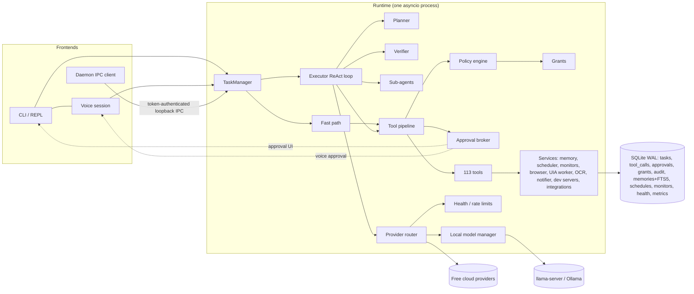
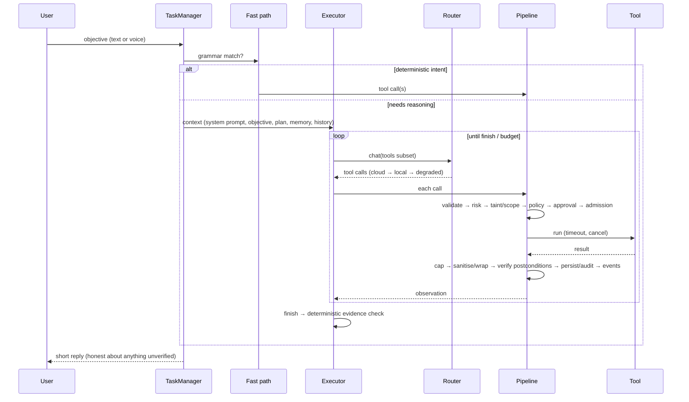

# Architecture

## Components

Code layout (`src/scar/`):

| Package | Responsibility |
|---|---|
| `core` | frozen data model (`TaskState`, `Action`, `ToolResult`, `Provenance`…), errors, typed event bus, cancellation, budgets, artifacts |
| `config` | settings with precedence and validation, paths, default policy and provider catalog |
| `security` | path guard, command guard (+ PowerShell AST parser), risk, policy, grants, approvals, autonomy, taint, scope, injection, secrets, redaction, privacy, audit, kill switch |
| `tools` | base class, registry, pipeline and every tool domain |
| `providers` | router, health, rate limits, OpenAI-compatible / Gemini / Anthropic / Ollama adapters, structured output, STT, TTS, embeddings, search, local model lifecycle |
| `agent` | runner (TaskManager), fast path + entity resolution, planner, executor, verifier, context builder, clarification, sub-agents, versioned prompts |
| `memory` | store (FTS5 + FAISS hybrid), write policy, extraction |
| `voice` | audio I/O, VAD, wake word, push-to-talk, session, voice approvals |
| `resources` | sampling (psutil, NVML), admission control, limits |
| `runtime` | composition root, service container, Job Objects/process manager, IPC, daemon |
| `integrations` | OAuth (PKCE loopback), Gmail, Graph, IMAP/SMTP, Telegram, Discord, WhatsApp, calendars |
| `cli` | typer app, REPL, renderer, doctor, status |

## Request flow

ACTION → OBSERVATION → VERIFICATION → NEXT ACTION: every side-effecting tool implements `verify()` (file hash,
window present with the expected title, URL loaded, exit code, dev server answered HTTP, message id…). `finish`
must carry evidence, which the runtime re-checks. An unverifiable result is reported as such, never rounded up.

## Process model

* One asyncio runtime hosts the agent, pipeline, scheduler, monitors, voice session and model lifecycle.
  UIA/COM runs on a dedicated STA worker thread; SQLite runs on its own thread; other blocking calls use `to_thread`.
* `scar` attaches to a running daemon (`scar daemon start`) over authenticated loopback IPC, or starts an embedded
  runtime. A lock file keeps it to one runtime per data folder.
* Child processes (commands, dev servers, llama-server) are created suspended, assigned to a Job Object with
  `KILL_ON_JOB_CLOSE`, then resumed. User apps (VS Code, Chrome) are launched detached (ADR 0012).
* Shutdown order: cancel tasks → persist → scheduler/monitors/voice → dev servers → managed model servers →
  remaining child trees → browser SCAR created → flush metrics and close the database.
* On startup, tasks that were running are marked `interrupted` and reported. Missed reminders are reported and
  recurring ones rescheduled. Folder, URL and download monitors re-arm; process monitors re-arm only if the same
  process (PID + creation time) is still alive.

## Agent loop details

* **Fast path** (`agent/fastpath`): a regex grammar for opening apps and editor folders, URLs, screenshots and
  screen description, system info, processes, media and volume, window arrangement, reminders, remember/forget,
  running tests, watching a process, status and cancel. Folder references resolve through memory aliases → the
  Windows Search index → Everything (`es.exe`) → a bounded scan. Ambiguity → a clarifying question.
* **Tool exposure**: a keyword category router picks a curated tool subset per objective (≤60 tools). Sub-agent
  roles get role-filtered subsets.
* **Context** (`agent/context.py`): system prompt (versioned template with the untrusted-data rule and the reply
  style), last conversation turns, the objective, memory notes, the plan, then the tool-call transcript. Old tool
  results are compacted to a few lines, then older exchanges are summarised; large outputs stay in artifacts
  (`read_artifact`). Context overflow triggers one compaction and a retry. The budget is tighter for local models.
* **Planner**: multi-step objectives (heuristic) get a structured plan (steps, candidate tools, success criteria,
  risk notes), revised after repeated failure.
* **Loop prevention**: step/token/time budgets, identical failing action ×3 → warning then replan then abort,
  no-progress window, and malformed-output penalties that shift to the next provider.
* **Recovery ladder**: retry with modification → alternative mechanism (UIA → OCR/vision → keyboard) → replan →
  ask the user → abort with a precise report of what was done and what failed.

## Resources

Resource sampling is on demand, plus periodic sampling (10 s) only while tasks are running or models are loaded.
Semaphores bound subprocesses, browser contexts, agents and concurrent model calls. OCR and vision are
rate-limited per minute. Queues are bounded (the event bus drops the oldest events for slow subscribers). Local
models and components (llama-server, Ollama models SCAR used, faster-whisper, embeddings, wake word) unload after
`SCAR_MODEL_IDLE_TIMEOUT`. Monitors use OS events (process handles, `ReadDirectoryChangesW` via watchdog, stream
reads) instead of polling.
